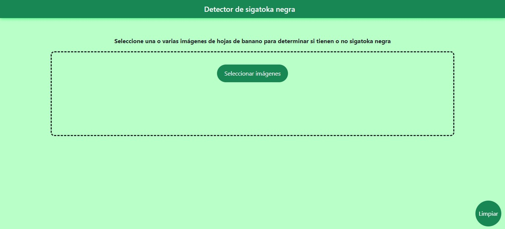
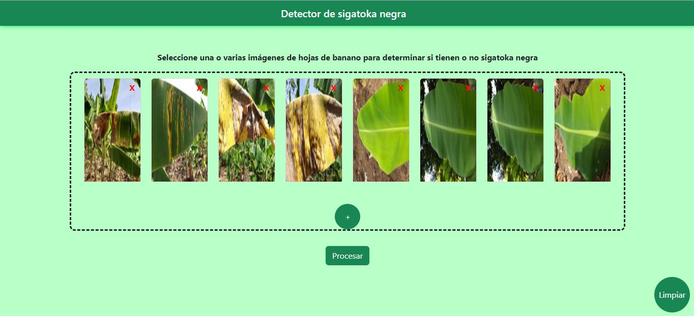
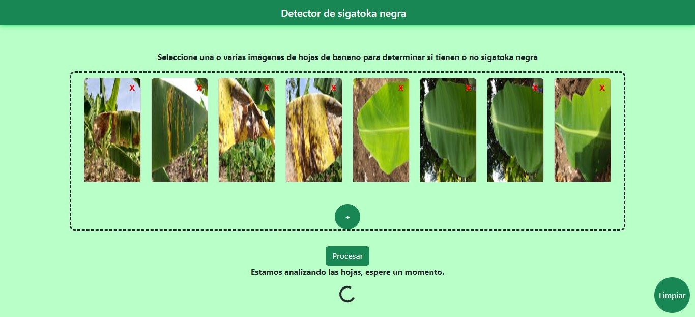
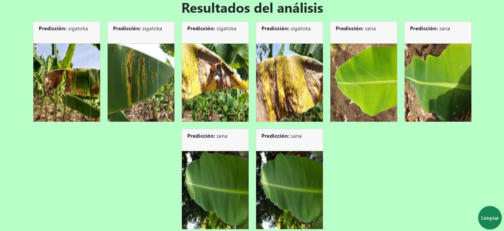

# SigatokaDetector
Sigatoka Detector es un proyecto de inteligencia artificial que tiene como objetivo determinar la presencia de sigatoka negra en hojas de banano. Utiliza una red neuronal convolucional implementada con Keras basada en la arquitectura VGG16.

## Descripción de la red neuronal
La red recibe imágenes RGB de 240x240 píxeles y devuelve un valor entre 0 y 1 que corresponde a la probabalidad de que la hoja tenga sigatoka negra. Las predicciones se realizan con un accuracy del 94%.

## Implementación y entrenamiento de la red

## Dataset

## GUI
La interfaz permite cargar tantas imágenes como el usuario requiera para posteriormente ejecutar el análisis y mostrar los resultados

## Autores
* [Edwars Sabando](https://github.com/Edwars1999)
* [Ricardo Vilcacundo](https://github.com/RicardoVilcacundo)
* [Héctor Villegas](https://github.com/hvillega99)

## Créditos
Las imágenes del dataset fueron tomadas de las siguientes fuentes:
* [Kaies Al Mahmud - Kaggle](https://www.kaggle.com/datasets/kaiesalmahmud/banana-leaf-dataset)
* [Godliver - GitHub](https://github.com/godliver/source-code-BBW-BBS/)
* [Harvard Dataverse](https://dataverse.harvard.edu/file.xhtml?fileId=6082183&version=1.0)
* [Y. Hailu - Mendeley Data](https://data.mendeley.com/datasets/rjykr62kdh/1)
* [E. Medhi - Mendeley Data](https://data.mendeley.com/datasets/4wyymrcpyz/1)
